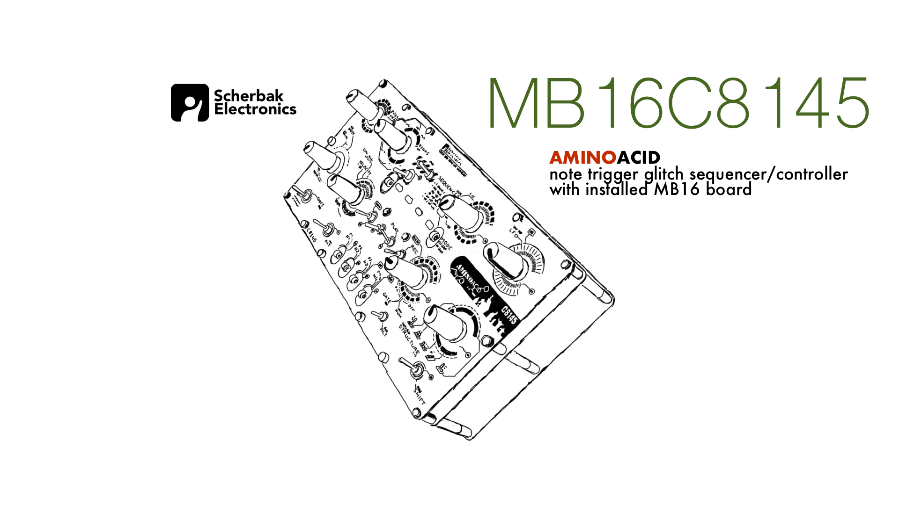

## About C8145 Aminoacid

This is a Note Trigger Glitching MIDI Sequencer designed for live performances
Creates awesome polyrhythm sequences easily by knobs turning 
Full documentation will be available soon..
